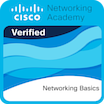

🖧 Cisco NetAcad Labs
📘 About This Repository

This repository documents my hands-on lab work from Cisco Networking Academy courses.
It focuses on step-by-step lab notes, configurations, and screenshots to demonstrate practical skills in networking and cybersecurity.

Currently included:
| Course | Badge (Credly) | Certificate |
|--------|----------------|-------------|
| Cisco Introduction to Cybersecurity |  | [📄 View PDF](Certificates/Introduction%20to%20Cybersecurity.pdf) |
| Cisco Networking Basics |  | [📄 View PDF](Certificates/Networking%20Basics.pdf) |
